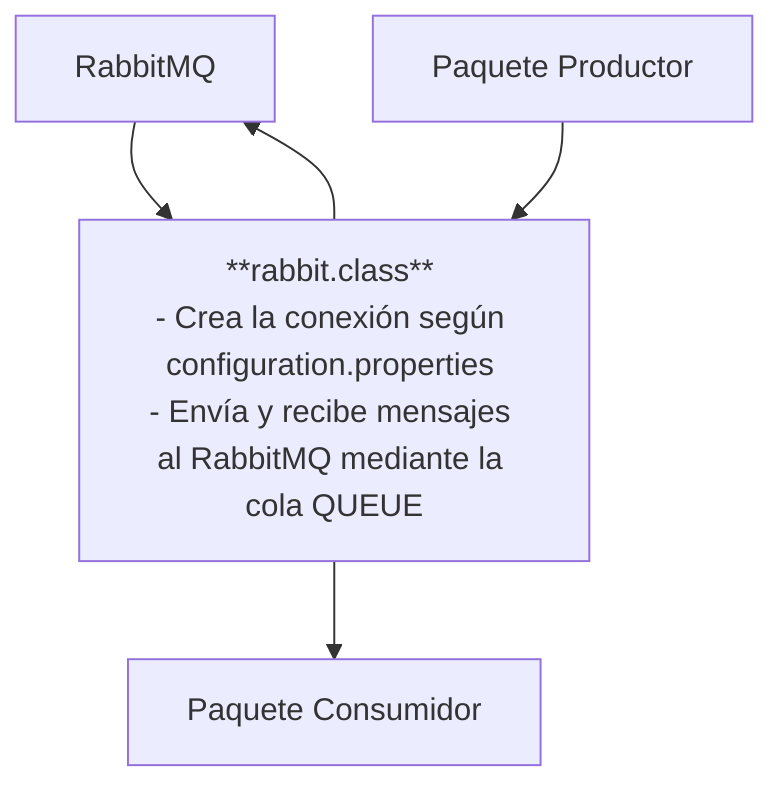

# test

```mermaid
  flowchart TD;
    A[RabbitMQ]-->B[**rabbit.class** \n- Crea la conexión según configuration.properties \n- Envía y recibe mensajes al RabbitMQ mediante la cola QUEUE];
    B-->A
    C[Paquete Productor\n]-->B
    B-->D[Paquete Consumidor]
   
    
```
